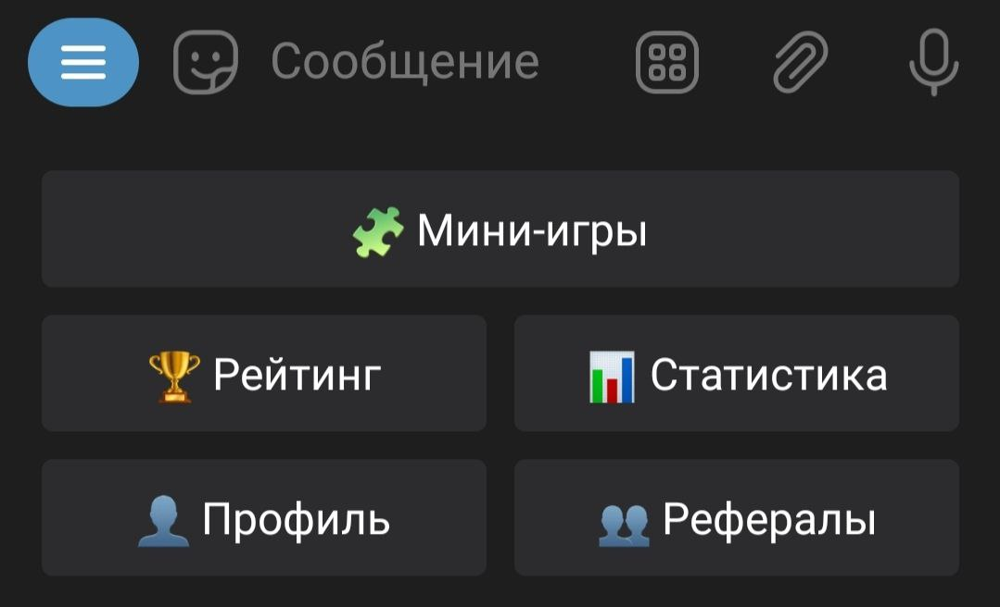

<h1 align="center">Mini-Games (Telegram Bot)</h1>

    
    
    
    
    
    

<h2>Описание проекта</h2>

Я создал телеграм бота, с которым ты точно не заскучаешь. В нём есть множество мини-игр, в которые можно поиграть прямо в сообщениях. Ты будешь соревноваться с другими игроками с помощью трофеев и ставить рекорды, чтобы обогнать других и стать №1. Ты также можешь наблюдать за очень подробной статистикой в боте.

<h2>Идея</h2>

Мне очень нравяться мини-игры в телеграм. Есть множество ботов, те же шашки или 4 в ряд и они манят своим простым геймплеем. Вот и я захотел создать ещё больше и оригинальных мини-игр, добавить трофеи, много статистики (очень много статистики), и множество других функций. Я придумал много оригинальных игр, а также у меня есть желание переносить в телеграм более популярные обычные игры: 2048, сапёр и т.д. Также мне ещё нравяться телеграм игры, что не нужно ничего скачивать, но есть обратная сторона монеты, что игры не могут работать без интернета.

<h2>Описание бота</h2>
<h3>Главная клавиатура или главное меню</h3>

<h3>🧩 Мини-игры</h3>

В этом разделе находяться мини-игры в которые можно поиграть.

<h3>🏆 Рейтинг</h3>

Здесь собраны рекорды других игроков в разных мини-играх, из которых составлены рейтинги. Есть два вида рейтингов: "Пятёрка лидеров" и "Игроки около вас". С первым понятно, что будут высвечены пять лучших игроков, а во втором будут показаны два игрока выше вас и два игрока ниже вас по рейтингу.

<h3>📊 Статистика</h3>

Здесь собрана статистика об игроках, о том сколько они играют, а также статистика обо всех мини-играх. 

<h3>👤 Профиль</h3>

Здесь находиться информация об игроке: никнейм, эмодзи перед ником, который здесь же можно поменять, а также трофеи и другая интересная информация.

<h3>👥 Рефералы</h3>

Тут находиться ссылка для других новых пользователей. Увы, но за новых игроков, приведённых через ссылку, рефер ничего не получит. Есть только возможность попасть в рейтинг.

